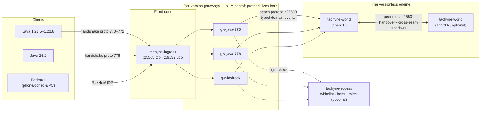

# tachyne — quickstart

> tachyne is an unofficial fan project, not affiliated with Mojang,
> Microsoft, or Minecraft's developer/publisher in any way. See the
> Disclaimer at the bottom.

## Project status

**Work in progress.** tachyne is young and moving fast: a full survival game
runs today, but expect rough edges, missing vanilla features, and breaking
changes between updates. **Bug reports are genuinely useful** — please open a
GitHub Issue with your client version/edition and what you saw. Contributions are
welcome too — see each code repo's `CONTRIBUTING.md`.

**What's implemented?** Before you commit an evening to it, read
[tachyne-world's feature matrix](https://github.com/tachyne/tachyne-world#what-to-expect-vanilla-parity-at-a-glance)
— an honest implemented / partial / missing table. Short version: the full
survival loop, the complete mob roster, enchanting/brewing/anvils, villages,
the Nether and the End with the dragon fight, redstone tier 1, the whole
vanilla advancement tree and the Statistics screen all work — as do maps,
scoreboards, fishing and the modern weapons; raids and most generated
structures don't yet.


**One world, every client.** tachyne is a Minecraft-compatible server written
from scratch in pure Go, with a versionless core: the engine simulates the
world and emits typed domain events; per-version gateways render them into
whatever wire format each client speaks. Java 1.21.5–1.21.8, Java 26.2, and
Bedrock all join the same world — no client mods.

## Run it in one command (Docker)

```sh
TACHYNE_OPS=YourPlayerName docker compose up -d
```

- **Java** (1.21.5–1.21.8 or 26.2): connect to `<this-host>:25565`
- **Bedrock** (latest): connect to `<this-host>:19132`

That's the **classic experience**: a single world container, procedurally
generated, effectively infinite, full survival — no sharding, no boundaries.

> **Open by default:** a fresh server has no whitelist and Java logins are
> offline-mode (no account verification — anyone can join under any name).
> Perfect for a LAN; don't expose it to the internet as-is. For real
> authorization, add [tachyne-access](https://github.com/tachyne/tachyne-access).

### Variant: walk the real Cape Town

```sh
TACHYNE_OPS=YourPlayerName docker compose -f docker-compose.yml -f docker-compose.earth.yml up -d
```

Earth mode replaces the terrain generator with real elevation data
(Copernicus GLO-30): greater Cape Town at **true 1:1 scale — horizontally
and vertically** (the world ceiling is raised so Table Mountain's plateau
stands at its real ~1,060 m). You spawn in the city bowl looking up at it,
in creative so you can fly it.

## Run it on Kubernetes

```sh
kubectl apply -f k8s/tachyne.yaml
```

The same single-world stack as the compose file (change the attach token in
the Secret first). For the **sharded multi-pod world** — one world split
across pods with seamless handover — and earth-mode deployment, see
[tachyne-world](https://github.com/tachyne/tachyne-world) (`deploy/`,
`docs/SHARDING-BUILD.md`, `docs/EARTH.md`).

## How it stitches together



The key property: the engine has **no Minecraft wire code at all**. Adding
support for a new Minecraft version means a new translation step in a
gateway — the world, and everyone playing in it, never changes.

## Plugins

The stack ships the whole plugin system: a NATS bus, the **plugin manager**
(installs, builds, and supervises daemon plugins while everything runs) and
the **plugin registry** (search, versions, ratings). As an op, just type
**`/plugin`** in game — a chest-style browser opens with everything
installed and everything available; click to install, upgrade (progressive
across shards), uninstall, or rate.

Your registry starts empty. List the first plugin — the live web map — with
one request, then install it from the in-game browser:

```bash
curl -X POST localhost:8080/v1/plugins -d '{"module":"github.com/tachyne/tachyne-world/daemons/webmap"}'
```

Once installed, the map is at `http://<this-host>:8100`. There's also
**bluemap** — a full 3D map rendered by
[BlueMap](https://bluemap.bluecolored.de/) — at `http://<this-host>:8124`:
list `github.com/tachyne/tachyne-world/daemons/bluemap` the same way, but
first uncomment `BLUEMAP_ACCEPT_DOWNLOAD` in the compose file (BlueMap
renders with Mojang's textures, and downloading them means accepting
Mojang's EULA). Writing your own plugins (in-process Go or any-language
bus daemons):
[the plugin docs](https://github.com/tachyne/tachyne-world/blob/main/docs/PLUGINS.md).

## The repos

| Repo | Role |
|---|---|
| [tachyne-world](https://github.com/tachyne/tachyne-world) | the engine: simulation, worldgen, sharding, earth mode |
| [tachyne-common](https://github.com/tachyne/tachyne-common) | shared library: attach protocol, renderer, translation chain, gateway pipeline |
| [tachyne-gw-java-770](https://github.com/tachyne/tachyne-gw-java-770) · [-776](https://github.com/tachyne/tachyne-gw-java-776) · [-bedrock](https://github.com/tachyne/tachyne-gw-bedrock) | per-version client gateways |
| [tachyne-ingress](https://github.com/tachyne/tachyne-ingress) | the front door: version routing + UDP forwarding |
| [tachyne-access](https://github.com/tachyne/tachyne-access) | authorization: whitelist, bans, roles, IP ACL |
| [tachyne-plugin-manager](https://github.com/tachyne/tachyne-plugin-manager) | pulls, builds, boots and supervises daemon plugins |
| [tachyne-registry](https://github.com/tachyne/tachyne-registry) | plugin registry: discovery over git-hosted plugins |

Contributions welcome — see each repo's `CONTRIBUTING.md`.

## License

Apache-2.0 — see [LICENSE](LICENSE) and [NOTICE](NOTICE).

## Disclaimer

tachyne is an unofficial, independent project. It is **not** affiliated with,
endorsed, sponsored, or approved by Mojang Studios, Mojang Synergies AB,
Microsoft Corporation, or any of their subsidiaries — the developer and
publisher of Minecraft have no involvement with this project. "Minecraft" is
a trademark of Mojang Synergies AB. This project contains no Minecraft game
code.
